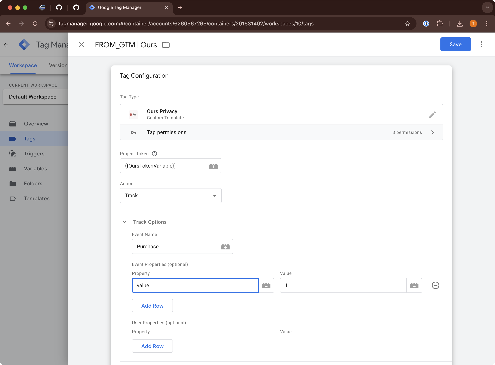
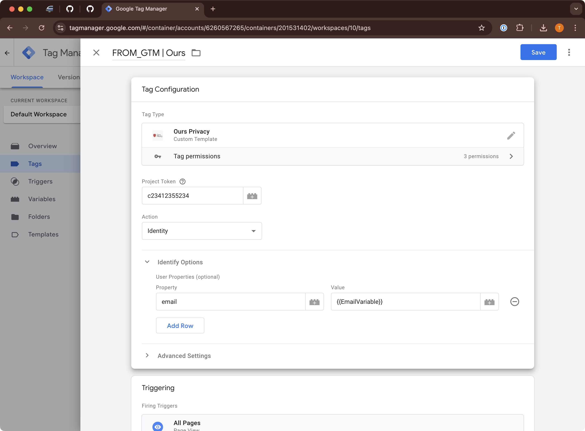

# Ours Privacy / Google Tag Manager Custom Tag Template

This repository contains the Ours Privacy Javascript SDK implement via a Google Tag Manager custom tag template.

## Overview

The Ours Privacy GTM template simplifies event tracking and user identification by integrating directly with the Ours Privacy SDK. This template automatically initializes the SDK whenever a tag using it fires, eliminating the need to manually install or configure the SDK script on your site.

This template automatically installs the code (meaning you should not and do not need to manually add the SDK script to your site).

This template allows you to create triggers for any and all events you allow through Ours Privacy.

---

## Manual Installation

The easiest way to install this template is to locate it in the [Google Tag Manager Community Template Gallery](https://tagmanager.google.com/gallery/) and add it via the GTM UI.

To manually install the template for testing or debugging purposes:

1. Download the `template.tpl` file from this repository.
2. Open your GTM container via the [GTM UI](https://tagmanager.google.com/).
3. Navigate to **Templates**, and in the **Tag Templates** section, click **New**.
4. In the **Template Editor**, open the menu (three vertical dots) and select **Import** and add this template.

---

## How the Template Works

### Automatic Initialization
When any tag using the Ours Privacy template fires, the SDK is automatically initialized if it hasn't been already. The initialization uses the configuration options specified in the GTM UI, and you don’t need to manually set up the token or include the SDK script on your site.

Using this tag, is the same as calling `ours('track', 'Event Name', {eventProperties}, {userProperties})`.

You should not manually call the ours function for an event you are also tracking through this integration.

### Example Tracking Configuration

### Example User Identification Configuration

### Event Tracking and User Identification
The template supports two primary actions:
1. **Identify Users:** Define user properties to associate with a unique user ID.
2. **Track Events:** Configure events and their properties, allowing you to track user interactions seamlessly.

To track an event, configure it in the GTM UI and trigger it using any standard GTM trigger (e.g., pageviews, clicks). You can define events for all allowed actions in your app, ensuring they fire correctly through GTM.

---

## Testing the Template

1. Add a trigger to your tag (e.g., **All Pages**) to define when it fires.
2. Save the tag and click the **Preview** button in GTM.
3. Open your website in Preview mode to test the tag and ensure events are firing correctly.
4. Use GTM’s Tag Assistant to debug and verify the data being sent.

---

For more information, visit:
- **Ours Privacy Website**: [oursprivacy.com](https://oursprivacy.com)
- **Documentation**: [docs.oursprivacy.com](https://docs.oursprivacy.com)